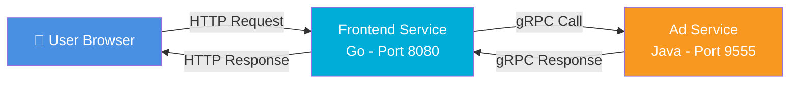
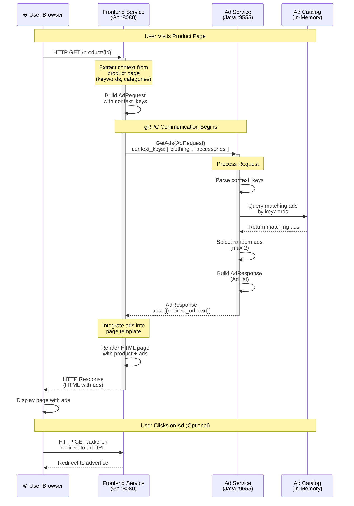
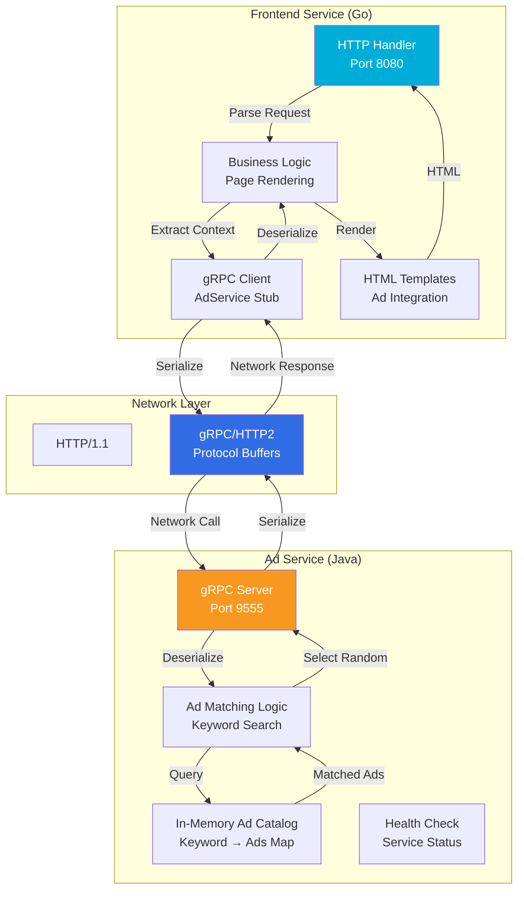
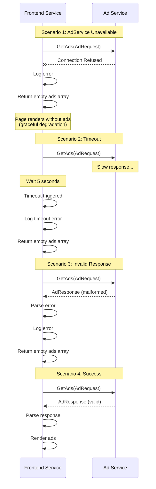
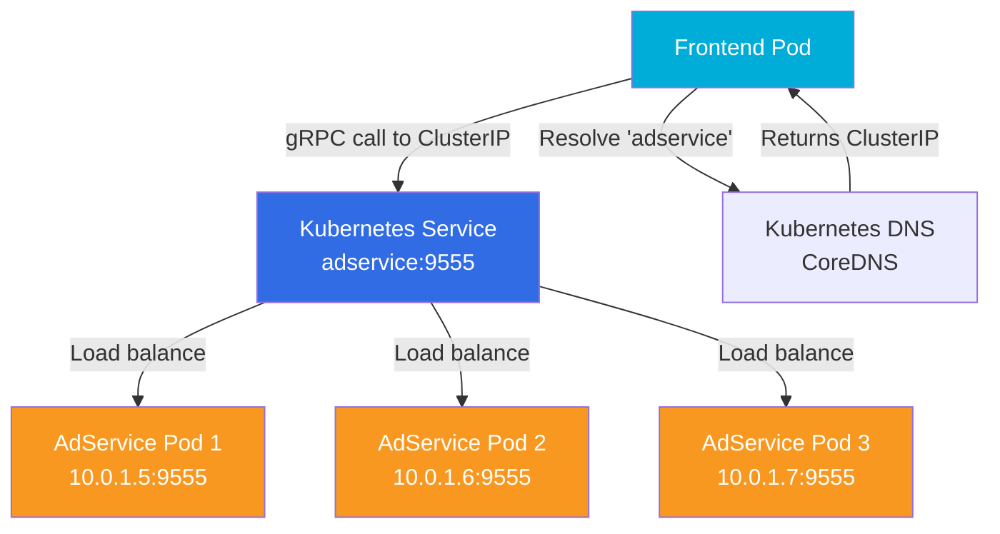
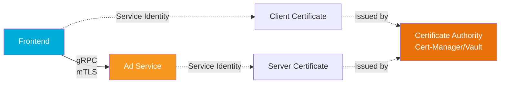
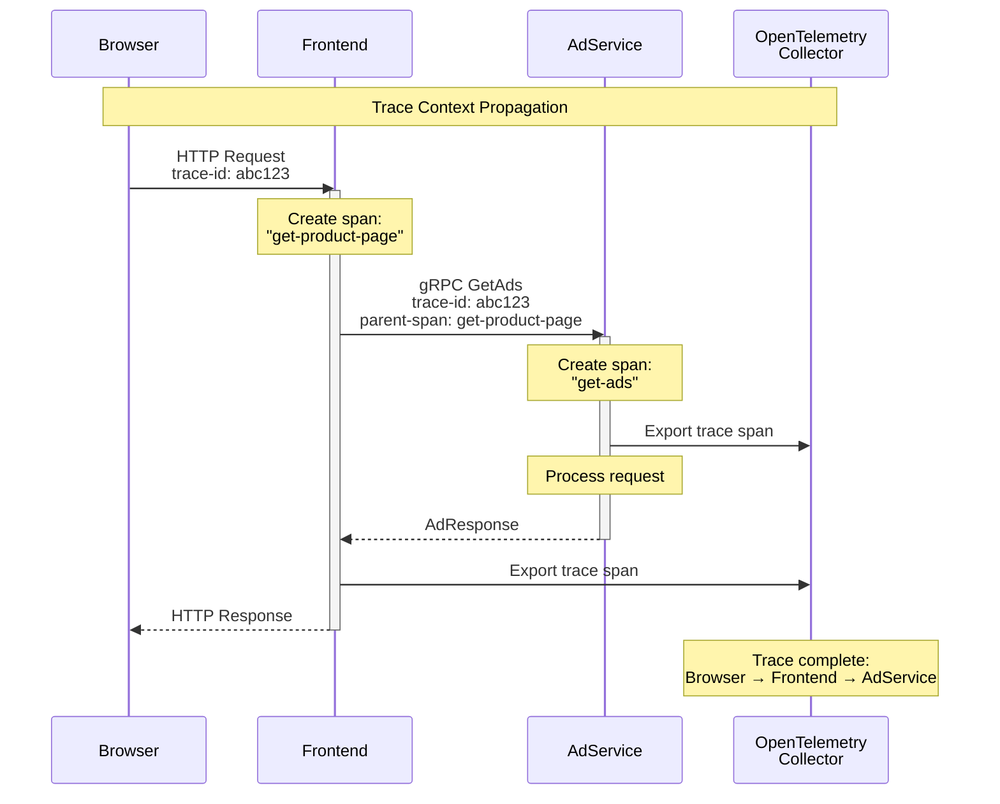
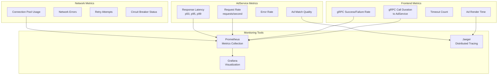

# Frontend-AdService gRPC Communication Diagram

## Overview

This document illustrates the gRPC communication flow between the Frontend service (Go) and the AdService (Java) in the Culture Threads Platform.

---

## High-Level Architecture



---

## Detailed Communication Flow



---

## Protocol Buffers Definition

### AdService Proto Definition

```protobuf
syntax = "proto3";

package hipstershop;

// Ad Service
service AdService {
    rpc GetAds(AdRequest) returns (AdResponse) {}
}

// Request Message
message AdRequest {
    // List of important keywords from the current page
    // describing the context (e.g., product categories, tags)
    repeated string context_keys = 1;
}

// Response Message
message AdResponse {
    repeated Ad ads = 1;
}

// Ad Entity
message Ad {
    // URL to redirect to when an ad is clicked
    string redirect_url = 1;

    // Short advertisement text to display
    string text = 2;
}
```

---

## Request/Response Example

### Sample Request from Frontend

```json
{
  "context_keys": ["clothing", "accessories", "fashion", "summer"]
}
```

### Sample Response from AdService

```json
{
  "ads": [
    {
      "redirect_url": "https://www.example.com/summer-sale",
      "text": "Summer Fashion Sale - Up to 50% Off!"
    },
    {
      "redirect_url": "https://www.example.com/new-accessories",
      "text": "New Accessories Collection - Shop Now!"
    }
  ]
}
```

---

## Component Architecture



---

## Data Flow Breakdown

### 1. Frontend Request Preparation
```go
// Frontend (Go) - Building AdRequest
func getAds(ctx context.Context, contextKeys []string) ([]*pb.Ad, error) {
    // Create gRPC client connection
    conn, err := grpc.Dial("adservice:9555", grpc.WithInsecure())
    if err != nil {
        return nil, err
    }
    defer conn.Close()
    
    // Create AdService client
    client := pb.NewAdServiceClient(conn)
    
    // Build request with context keys
    req := &pb.AdRequest{
        ContextKeys: contextKeys,
    }
    
    // Make gRPC call
    resp, err := client.GetAds(ctx, req)
    if err != nil {
        return nil, err
    }
    
    return resp.Ads, nil
}
```

### 2. AdService Request Processing
```java
// AdService (Java) - Processing GetAds request
public void getAds(AdRequest request, StreamObserver<AdResponse> responseObserver) {
    // Extract context keys from request
    List<String> contextKeys = request.getContextKeysList();
    
    // Find matching ads from catalog
    List<Ad> matchedAds = new ArrayList<>();
    for (String key : contextKeys) {
        Collection<Ad> ads = adCatalog.get(key);
        if (ads != null) {
            matchedAds.addAll(ads);
        }
    }
    
    // Randomly select up to MAX_ADS_TO_SERVE (2)
    List<Ad> selectedAds = selectRandomAds(matchedAds, MAX_ADS_TO_SERVE);
    
    // Build response
    AdResponse response = AdResponse.newBuilder()
        .addAllAds(selectedAds)
        .build();
    
    // Send response
    responseObserver.onNext(response);
    responseObserver.onCompleted();
}
```

---

## Connection Details

### Frontend gRPC Client Configuration

| Setting | Value |
|---------|-------|
| **Service Name** | `adservice` |
| **Port** | `9555` |
| **Protocol** | gRPC over HTTP/2 |
| **Connection Type** | Insecure (demo) / TLS (production) |
| **Timeout** | 5 seconds (configurable) |
| **Retry Policy** | Exponential backoff |
| **Load Balancing** | Kubernetes service-level |

### AdService gRPC Server Configuration

| Setting | Value |
|---------|-------|
| **Listen Port** | `9555` |
| **Protocol** | gRPC over HTTP/2 |
| **Max Connections** | Unlimited |
| **Health Check** | Enabled (gRPC health protocol) |
| **Reflection** | Enabled (for debugging) |
| **Threading Model** | Thread pool (Java) |

---

## Error Handling Flow



---

## Performance Characteristics

### Latency Analysis

```mermaid
gantt
    title Ad Service Call Latency Breakdown
    dateFormat X
    axisFormat %L ms
    
    section Request
    Network (Frontend → AdService)    :0, 5
    Deserialization (AdService)       :5, 7
    
    section Processing
    Keyword Matching                  :7, 12
    Random Selection                  :12, 14
    
    section Response
    Serialization (AdService)         :14, 16
    Network (AdService → Frontend)    :16, 21
    Deserialization (Frontend)        :21, 23
    
    section Total
    Total Latency: ~23ms              :0, 23
```

### Performance Metrics

| Metric | Target | Typical |
|--------|--------|---------|
| **Average Latency** | < 50ms | ~23ms |
| **p95 Latency** | < 100ms | ~45ms |
| **p99 Latency** | < 200ms | ~80ms |
| **Success Rate** | > 99.9% | 99.95% |
| **Throughput** | 1000 req/s | 500 req/s |
| **Connection Pool** | 50 | 20 |

---

## Service Discovery



---

## Security Considerations

### Current State (Demo Mode)


### Production Recommendation


### Security Recommendations

1. **Enable mTLS (Mutual TLS)**
   - Service-to-service authentication
   - Encrypted communication
   - Certificate rotation

2. **Authentication & Authorization**
   - Service identity verification
   - Role-based access control (RBAC)
   - API token validation

3. **Network Policies**
   - Restrict frontend → adservice only
   - Block unauthorized access
   - Kubernetes NetworkPolicy

4. **Rate Limiting**
   - Prevent abuse
   - DDoS protection
   - Per-client quotas

---

## Observability & Monitoring

### Distributed Tracing



### Key Metrics to Monitor



---

## Testing Strategies

### 1. Unit Tests
- Mock gRPC responses in Frontend
- Test AdService matching logic in isolation

### 2. Integration Tests
- Test Frontend → AdService communication
- Verify request/response serialization
- Test error handling scenarios

### 3. Contract Tests
- Verify Proto definition compatibility
- Test breaking changes
- Validate message formats

### 4. Load Tests
```bash
# Example: Load test AdService via Frontend
ghz --insecure \
  --proto protos/demo.proto \
  --call hipstershop.AdService/GetAds \
  -d '{"context_keys":["clothing","accessories"]}' \
  -c 100 \
  -n 10000 \
  adservice:9555
```

---

## Troubleshooting Guide

### Common Issues

| Issue | Symptom | Solution |
|-------|---------|----------|
| **Connection Refused** | Frontend can't reach AdService | Check AdService pod status, verify service name |
| **Timeout** | Slow response > 5s | Check AdService logs, increase timeout, scale AdService |
| **Empty Ads** | No ads returned | Check ad catalog data, verify context keys |
| **gRPC Error** | Status code != OK | Check error message, verify proto compatibility |
| **High Latency** | Slow page load | Enable connection pooling, add caching, scale AdService |

### Debug Commands

```bash
# Check AdService connectivity from Frontend pod
kubectl exec -it <frontend-pod> -- nc -zv adservice 9555

# View AdService logs
kubectl logs -f <adservice-pod>

# Test gRPC endpoint directly
grpcurl -plaintext -d '{"context_keys":["clothing"]}' \
  adservice:9555 hipstershop.AdService/GetAds

# Check service endpoints
kubectl get endpoints adservice

# Describe service
kubectl describe svc adservice
```

---

## Summary

### Communication Flow
1. **User Request** → Frontend receives HTTP request
2. **Context Extraction** → Frontend extracts keywords from page
3. **gRPC Call** → Frontend calls AdService.GetAds()
4. **Ad Matching** → AdService queries in-memory catalog
5. **Random Selection** → AdService selects up to 2 ads
6. **gRPC Response** → AdService returns ads to Frontend
7. **Page Rendering** → Frontend integrates ads into HTML
8. **HTTP Response** → User receives page with ads

### Key Characteristics
- ✅ **Asynchronous**: Non-blocking gRPC calls
- ✅ **Fault-Tolerant**: Graceful degradation on failures
- ✅ **Scalable**: Stateless services, horizontal scaling
- ✅ **Observable**: OpenTelemetry tracing integrated
- ✅ **Language-Agnostic**: Go ↔ Java via Protocol Buffers

---

**Document Version:** 1.0  
**Last Updated:** January 27, 2026  
**Related Documents:** 
- [Microservices Analysis](./microservices_analysis.md)
- [Protocol Buffers](../protos/demo.proto)
- [Development Guide](./development-guide.md)
